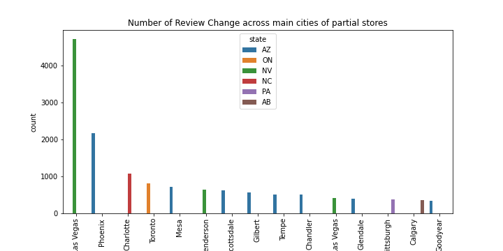

# Yelp Reviews

## Overview

This project will explore the reviews of businesses and restaurants on Yelp.com.

## Contents

1. [Dataset](#Dataset)
2. [Questions](#Questions)
3. [Exploration](#Exploration)
4. [Analysis](#Analysis)
5. [Geography](#Geography)
6. [Summary](#Summary)
7. [Discussion](#Discussion)

# Dataset

The original [Yelp dataset](https://www.yelp.com/dataset/) contains:

- 8,021,122 reviews
- 209,393 businesses
- 200,000 pictures
- 10 metropolitan areas
- 1,320,761 tips
- 1,968,703 users
- Over 1.4 million business attributes like hours, parking, availability, and ambience
- Aggregated check-ins over time for each of the 209,393 businesses

See [Dataset Documentation.](https://www.yelp.com/dataset/documentation/main)

# Questions

# Exploration

First, we search for businesses in the "business "dataset" that have the string "McDonald's" in the "name" column.

I merged the "reviews" dataset with the "McDonald's" dataset on the "business_id" column.

We are left with a final dataframe for McDonald's businesses with Yelp reviews: 20414 rows by 18 columns

The dataset encompasses a total of 12 states/provinces and a 216 cities.

---

```
Number of Stores Currently Open:  799
Number of Stores Currently Closed:  56
Total Number of Unique Stores:  855
Number of Total Reviews:  20414
```

# Analysis

## "A picture is worth a thousand words."

### Text Length of Review By Rating (1-5 Stars)


# Geography

## Arizona

- 8 out of the top 15 cities with the highest number of reviews are in Arizona.

## Nevada

- The state/prvoince with the highest number of reviews is Nevada.
- The city with the highest number of reviews is Las Vegas.

# Summary

- Arizona and Nevada have a high number of reviews for McDonald's in their state.

# Discussion

# Test


