# A Happy Meal: Predicting McDonald's Yelp Ratings Utilizing NLP and Machine Learning


## Overview

McDonald's Corporation is an American fast food company, founded in 1940 as a restaurant operated by Richard and Maurice McDonald, in San Bernardino, California, United States. They rechristened their business as a hamburger stand, and later turned the company into a franchise, with the Golden Arches logo being introduced in 1953 at a location in Phoenix, Arizona. In 1955, Ray Kroc, a businessman, joined the company as a franchise agent and proceeded to purchase the chain from the McDonald brothers. McDonald's had its original headquarters in Oak Brook, Illinois, but moved its global headquarters to Chicago in June 2018. [(source: Wikipedia)](https://en.wikipedia.org/wiki/McDonald%27s)

Yelp is an American public company headquartered in San Francisco, California. The company develops, hosts, and markets the Yelp.com website and the Yelp mobile app, which publish crowd-sourced reviews about businesses. It also operates an online reservation service called Yelp Reservations. [(source: Wikipedia)](https://en.wikipedia.org/wiki/Yelp)]

A critical component for fast food restaurant businesses is developing products like new food menu items that take into account customer feedback. This study seeks to explore the sentiment and satisfaction of McDonald's restaurants through written language on Yelp user reviews.

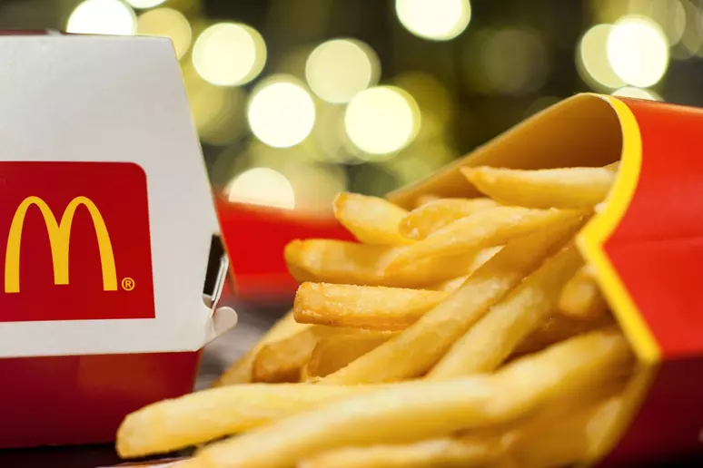

## Contents

- [Dataset](#Dataset)
- [Questions](#Questions)
- [Objectives](#Objectives)
- [Dataset](#Dataset)
- [Exploration](#Exploration)
- [Analysis](#Analysis)
- [Modeling](#Modeling)
- [Summary](#Summary)
- [Discussion](#Discussion)

# Questions

- What food words or menu items are most likely discussed in reviews?
- Which states/provinces or cities have the highest number of reviews?
- What meal time (e.g, breakfast, lunch, dinner, brunch) is mentioned the most in reviews?
- What menu items (e.g., French fries, McNuggets, Big Mac, Coke, quarterpounder) are mentioned the most in reviews?

# Objectives

- Find patterns in reviews such as food, time, people, emotion, and geography
- Utilize NLP and machine learning algorithms to predict ratings given a user review
- Provide insightful customer feedback for business stakeholders to utilize in new product development and research

# Dataset

The original [Yelp dataset](https://www.yelp.com/dataset/) contains:

- 8,021,122 reviews
- 209,393 businesses
- 200,000 pictures
- 10 metropolitan areas
- 1,320,761 tips
- 1,968,703 users
- Over 1.4 million business attributes like hours, parking, availability, and ambience
- Aggregated check-ins over time for each of the 209,393 businesses

See [Dataset Documentation.](https://www.yelp.com/dataset/documentation/main)


## Filtering for "McDonald's" restaurants

First, we search for businesses in the "business "dataset" that have the string "McDonald's" in the "name" column.

The "reviews" dataset with the "McDonald's" dataset are merged on the "business_id" column.

A final dataframe is created for McDonald's businesses with Yelp reviews: **20414 rows by 18 columns.**

The dataset encompasses a total of **12 states/provinces and a 216 cities.**

---

```
Number of Stores Currently Open:  799
Number of Stores Currently Closed:  56
Total Number of Unique Stores:  855
Number of Total Reviews:  20414
```

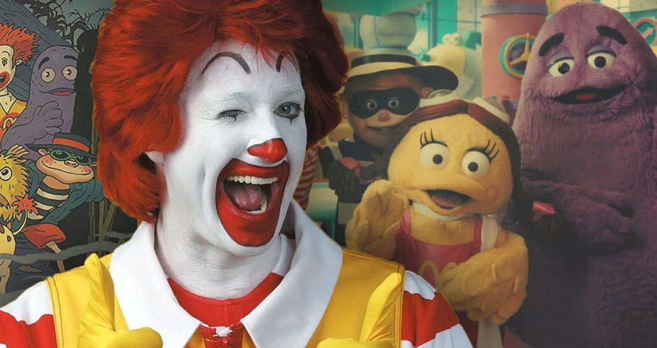

# Exploration

## Descriptive Statistics

### Columns

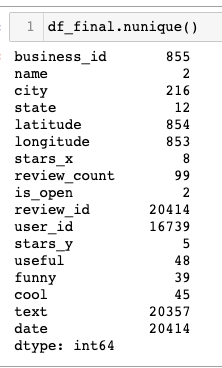

### Ratings by Vote Type

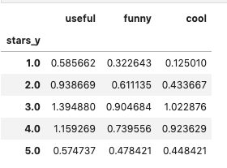

# NLP

## Text Preprocessing

### Raw Text

<p>
"I think most of us have certain expectations of any restaurant. My experience with this location has poisoned me against all McDonald's. It started when my wife said she wanted a fruit smoothy. We ordered our smoothies which came to $8 for 2 larges. Cool fun thing to do right...\n\nThe next day I saw my card had been double charged. So I went back and asked the manager if she could make it right. I said I didn't even need a cash refund it would have been fine to just take it off the order I was about to make. She said she could not do that and that she had no way to look it up. She gave me a phone number to their office in Mentor. I called the person in Mentor who looked up my order she said I needed to wait 10 days or so because the card had been authorized but not charged twice. \n\n10 days later the charge came off but I expect when I go out for food my card will not be double authorized. Be that as it may $8 worth of food would have fixed this. I will NEVER go back to McDonald's because of how this was handled."

### Round 1

<p>

'i think most of us have certain expectations of any restaurant my experience with this location has poisoned me against all mcdonalds it started when my wife said she wanted a fruit smoothy we ordered our smoothies which came to for larges cool fun thing to do right\n\nthe next day i saw my card had been double charged so i went back and asked the manager if she could make it right i said i didnt even need a cash refund it would have been fine to just take it off the order i was about to make she said she could not do that and that she had no way to look it up she gave me a phone number to their office in mentor i called the person in mentor who looked up my order she said i needed to wait days or so because the card had been authorized but not charged twice \n\n days later the charge came off but i expect when i go out for food my card will not be double authorized be that as it may worth of food would have fixed this i will never go back to mcdonalds because of how this was handled'

</p>

### Round 2

<p>

'i think most of us have certain expectations of any restaurant my experience with this location has poisoned me against all mcdonalds it started when my wife said she wanted a fruit smoothy we ordered our smoothies which came to for larges cool fun thing to do rightthe next day i saw my card had been double charged so i went back and asked the manager if she could make it right i said i didnt even need a cash refund it would have been fine to just take it off the order i was about to make she said she could not do that and that she had no way to look it up she gave me a phone number to their office in mentor i called the person in mentor who looked up my order she said i needed to wait days or so because the card had been authorized but not charged twice days later the charge came off but i expect when i go out for food my card will not be double authorized be that as it may worth of food would have fixed this i will never go back to mcdonalds because of how this was handled'

## Insights

### By Food

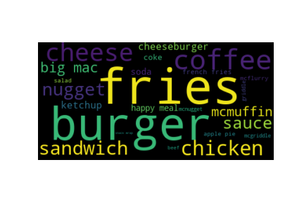

### By Time

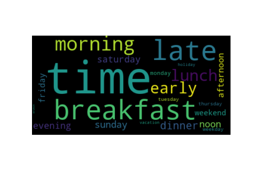

### By Emotion

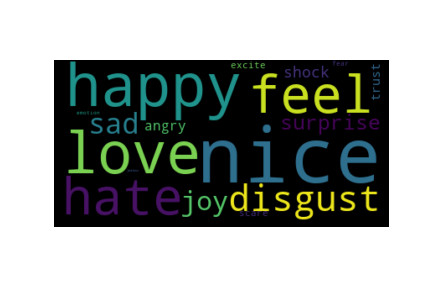

### By People

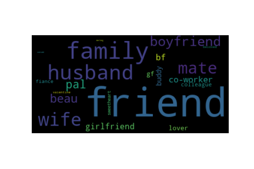

### By Geography

- 8 out of the top 15 cities with the highest number of reviews are in Arizona.
- The city with the highest number of reviews is Las Vegas.
- The state/province with the highest number of reviews is Nevada.

  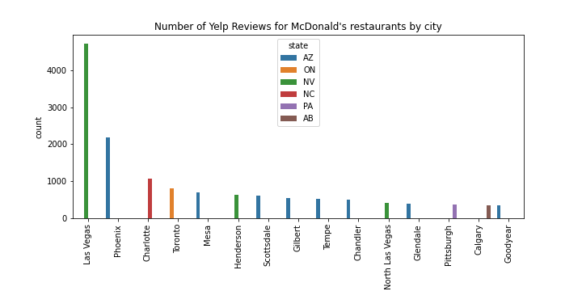
  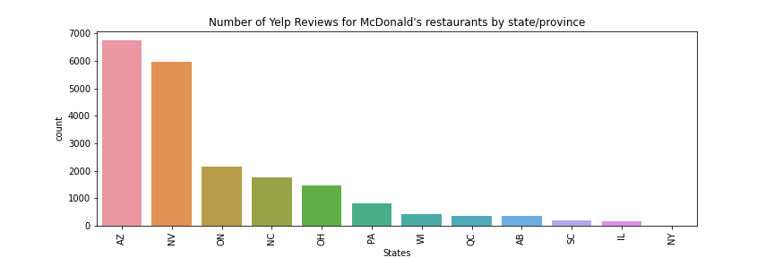

# Analysis

## "A picture is worth a thousand words."

### Text Length of Review By Rating (1-5 Stars)

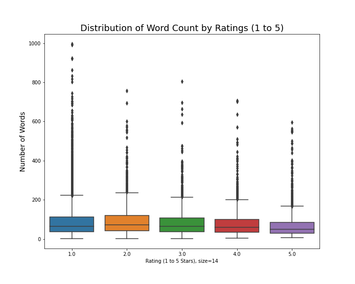

```

count 20414.000000
mean 87.198344
std 78.778958
min 1.000000
25% 37.000000
50% 63.000000
75% 109.000000
max 997.000000
Name: word_count, dtype: float64

```

### Character Length of Reviews By Rating (1-5 Stars)

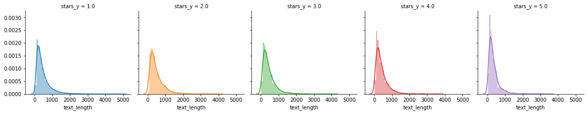

```

count 20414.000000
mean 464.655971
std 416.272056
min 1.000000
25% 199.000000
50% 338.000000
75% 577.000000
max 4989.000000
Name: text_length, dtype: float64

```

## "The customer is always right."

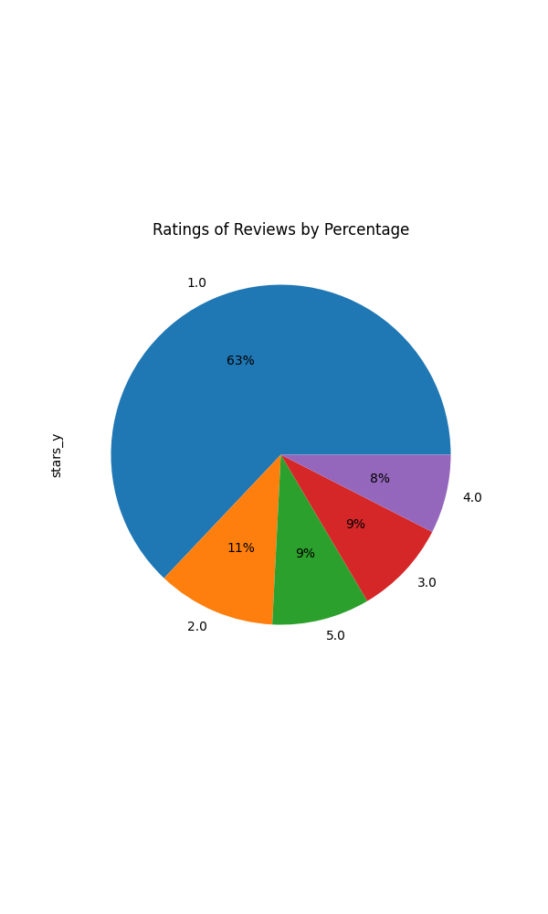

```

count 20414.000000
mean 1.889928
std 1.358338
min 1.000000
25% 1.000000
50% 1.000000
75% 3.000000
max 5.000000
Name: stars_y, dtype: float64

```

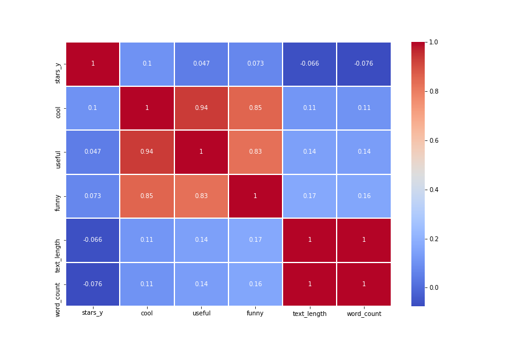

# Modeling

## Classification

### Random Forest Classifier

```

[[2529 0 5 1 14]
[ 435 2 8 2 10]
[ 270 1 29 23 58]
[ 162 1 21 34 102]
[ 161 0 7 21 187]]
precision recall f1-score support

         1.0       0.71      0.99      0.83      2549
         2.0       0.50      0.00      0.01       457
         3.0       0.41      0.08      0.13       381
         4.0       0.42      0.11      0.17       320
         5.0       0.50      0.50      0.50       376

    accuracy                           0.68      4083

macro avg 0.51 0.34 0.33 4083
weighted avg 0.62 0.68 0.59 4083

0.6811168258633358

```

In predicting ratings using NLP from text data of reviews, the Random Forest algorithm achieved an accuracy of **68.11%**.

### Feature Importances

```
1. feature 963 (0.016805)
2. feature 894 (0.015739)
3. feature 949 (0.014289)
4. feature 2462 (0.013126)
5. feature 420 (0.012239)
6. feature 1466 (0.010481)
7. feature 235 (0.009764)
8. feature 806 (0.008044)
9. feature 1739 (0.007458)
10. feature 1335 (0.006742)
11. feature 863 (0.006698)
12. feature 1278 (0.006067)
13. feature 1685 (0.005839)
14. feature 1931 (0.005757)
15. feature 1400 (0.005549)
16. feature 109 (0.005339)
17. feature 1531 (0.005322)
18. feature 669 (0.004888)
19. feature 889 (0.004689)
20. feature 745 (0.004646)
```

### Multinomial Naive Bayes

```

Confusion Matrix for Multinomial Naive Bayes:
[[2542 1 5 0 1]
[ 433 5 15 1 3]
[ 250 7 68 32 24]
[ 164 3 50 48 55]
[ 187 0 11 22 156]]
Score: 69.04
Classification Report: precision recall f1-score support

         1.0       0.71      1.00      0.83      2549
         2.0       0.31      0.01      0.02       457
         3.0       0.46      0.18      0.26       381
         4.0       0.47      0.15      0.23       320
         5.0       0.65      0.41      0.51       376

    accuracy                           0.69      4083

macro avg 0.52 0.35 0.37 4083
weighted avg 0.62 0.69 0.61 4083

```

In predicting ratings using NLP from text data of reviews, the Multinomial Naive Bayes algorithm achieved an accuracy of **69.04%**

### Decision Tree

```

Confusion Matrix for Decision Tree:
[[2019 223 145 72 90]
[ 269 75 60 25 28]
[ 137 54 76 58 56]
[ 65 32 51 62 110]
[ 85 22 50 69 150]]
Score: 58.34
Classification Report: precision recall f1-score support

         1.0       0.78      0.79      0.79      2549
         2.0       0.18      0.16      0.17       457
         3.0       0.20      0.20      0.20       381
         4.0       0.22      0.19      0.20       320
         5.0       0.35      0.40      0.37       376

    accuracy                           0.58      4083

macro avg 0.35 0.35 0.35 4083
weighted avg 0.58 0.58 0.58 4083

```

In predicting ratings using NLP from text data of reviews, the Multinomial Naive Bayes algorithm achieved an accuracy of **58.34%**.

### Support Vector Machines (SVM)

- Took almost 16 minutes to process on local machine.

```

Confusion Matrix for Support Vector Machines:
[[2520 6 9 1 13]
[ 411 6 29 6 5]
[ 171 12 105 56 37]
[ 65 10 66 84 95]
[ 84 0 23 42 227]]
Score: 72.05

```

In predicting ratings using NLP from text data of reviews, the Support Vector Machines (SVM) algorithm achieved an accuracy of **72.05%**.

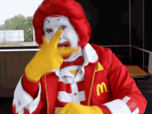

## Regression

### Random Forest Regressor

Metrics for Random Forest Trained on Expanded Data
Average absolute error: 0.64 degrees.
<br>
RMSE = 0.9340418438455377
<br>
MSE = 0.8724341660543717

### XGBoostRegressor

## Computational Speed

| Model                         | Speed      |
| ----------------------------- | ---------- |
| Multinomial Naive Bayes       | 125ms      |
| Decision Tree                 | 1m 10.61s  |
| RandomForestClassifier        | 2m 7.45s   |
| Gradient Boosting Regressor   | 4m 40.42s  |
| Support Vector Machines (SVM) | 15m 45.19s |
| RandomForestRegressor         | 24m 44.34s |
| XGBoost                       | 1h 5m 5s   |
| RandomForestRegressor         | 1h 38m 39s |

# Summary

## Rating

- Often negative reviews (1 or 2 star) have more outliers that tend to be on the longer side.
  - People often have a lot to say about things they do NOT like.
  - Criticism is often a long form of poetry.

## Location

- Arizona and Nevada have a high number of reviews for McDonald's in their state.

## Food

- Burgers and fries are commonly talked about in reviews.
- Breakfast is the most commonly talked about meal of the day in reviews.
- Although the official menu item is called chicken "McNuggets", the majority of users refer to the menu item as just simply "nuggets".
- In addition, customers prefer to use "fries" instead of "French fries" much more often in the written reviews.

## Time

- For events, 'customers often mention a "game", "event", or "party".
- With regards to time, customers often mention the words "time", "late", and "breakfast" .

## People

- For people and relationships, customers VERY often mention a "friend". Other people also commonly mentioned include "husband", "wife", and "mate".

## Modeling

- In the predictive modeling of ratings (1 to 5 stars), the best multinomial classification model out of the 4 chosen algorithms was: **Support Vector Machines (SVM)**
- Using NLP to predict ratings from written reviews is a difficult task.
  - Some difficulties include vocabulary, slang, vernacular, regional dialect, and grammar variability in detecting patterns for sentiment analysis.


# Discussion

- How can company stakeholders make strategic decisions in product development given these insights from data?
- What metrics can be analyzed to indicate performance through the next quarter or fiscal year?
- How can data scientists utilize machine learning to detect fake reviews that artificially affect the ratings of businesses?


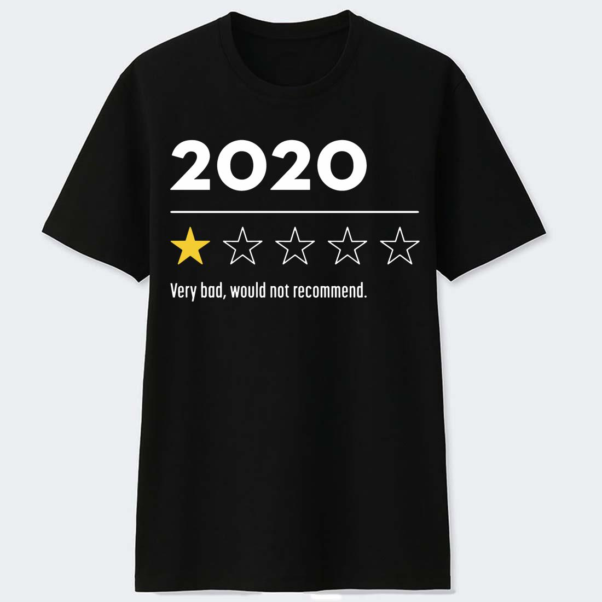
```
