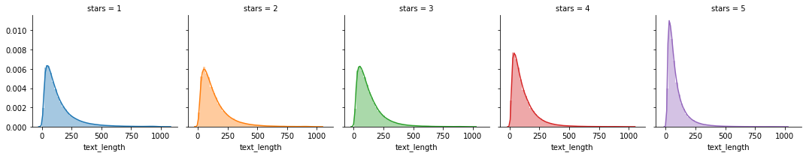

# Yelp Reviews

## Overview

This project will explore the reviews of businesses and restaurants on Yelp.com.

## Contents

1. [Dataset](#Dataset)
2. [Questions](#Questions)
3. [Exploration](#Exploration)
4. [Analysis](#Analysis)
5. [Geography](#Geography)
6. [Summary](#Summary)
7. [Discussion](#Discussion)

# Dataset

The original [Yelp dataset](https://www.yelp.com/dataset/) contains:

- 8,021,122 reviews
- 209,393 businesses
- 200,000 pictures
- 10 metropolitan areas
- 1,320,761 tips
- 1,968,703 users
- Over 1.4 million business attributes like hours, parking, availability, and ambience
- Aggregated check-ins over time for each of the 209,393 businesses

See [Dataset Documentation.](https://www.yelp.com/dataset/documentation/main)

# Questions

# Exploration

# Analysis

## "A picture is worth a thousand words."

### Text Length of Review By Rating (1-5 Stars)

# Geography

# Summary

# Discussion
